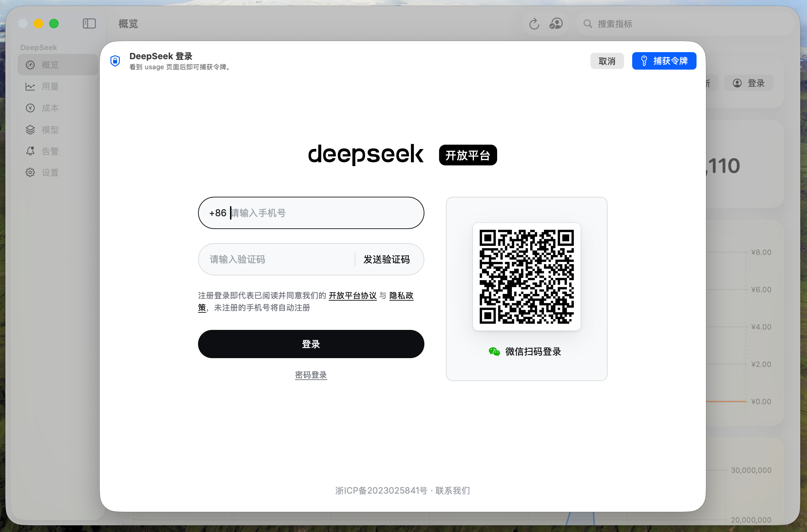
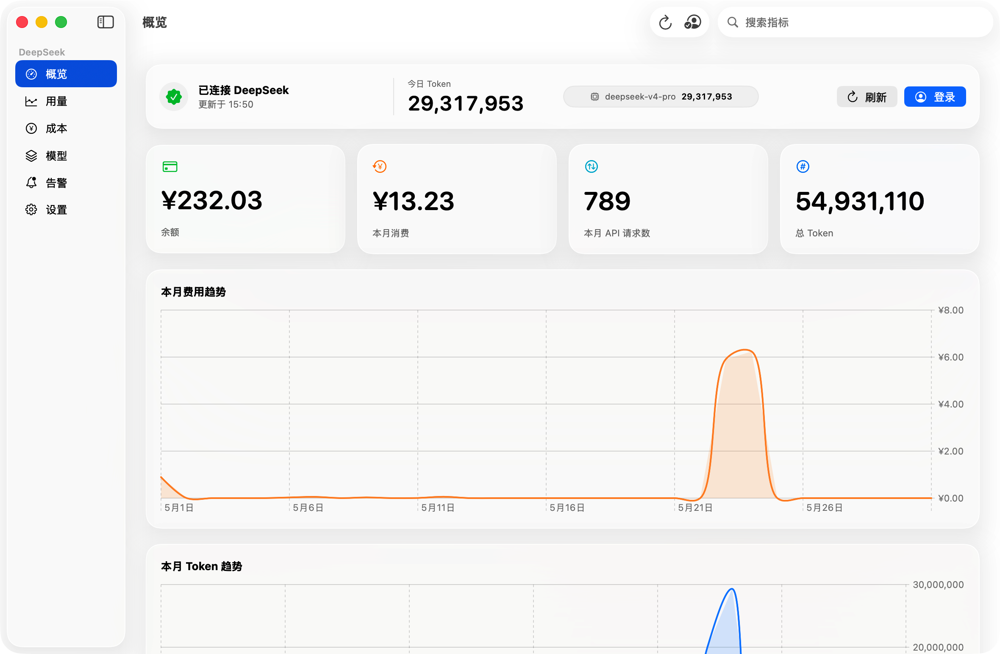
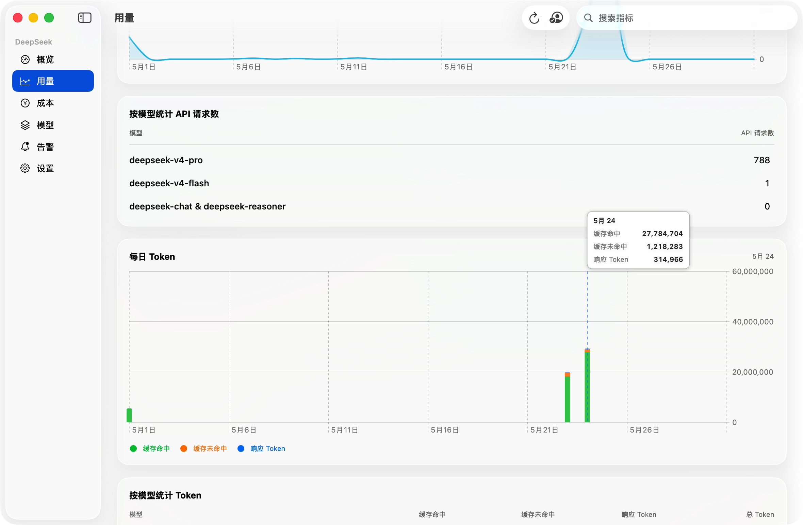
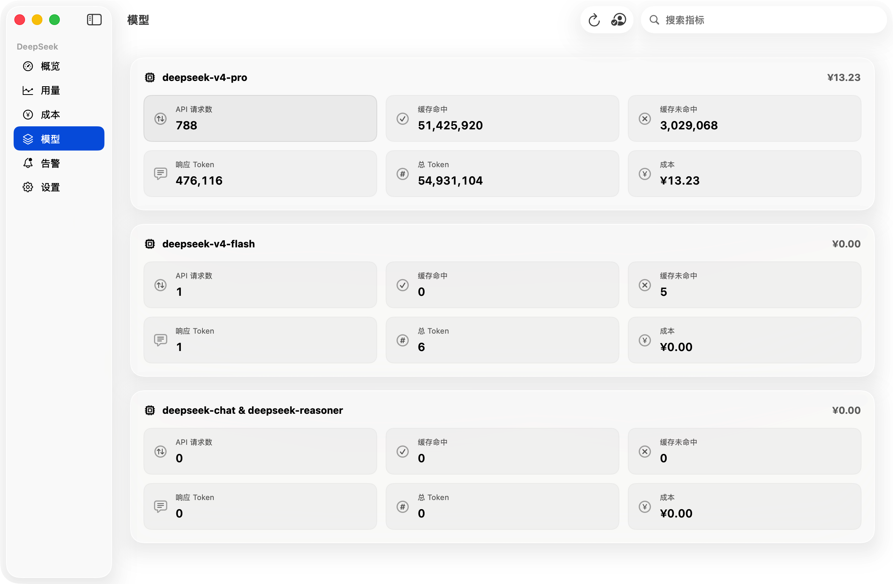
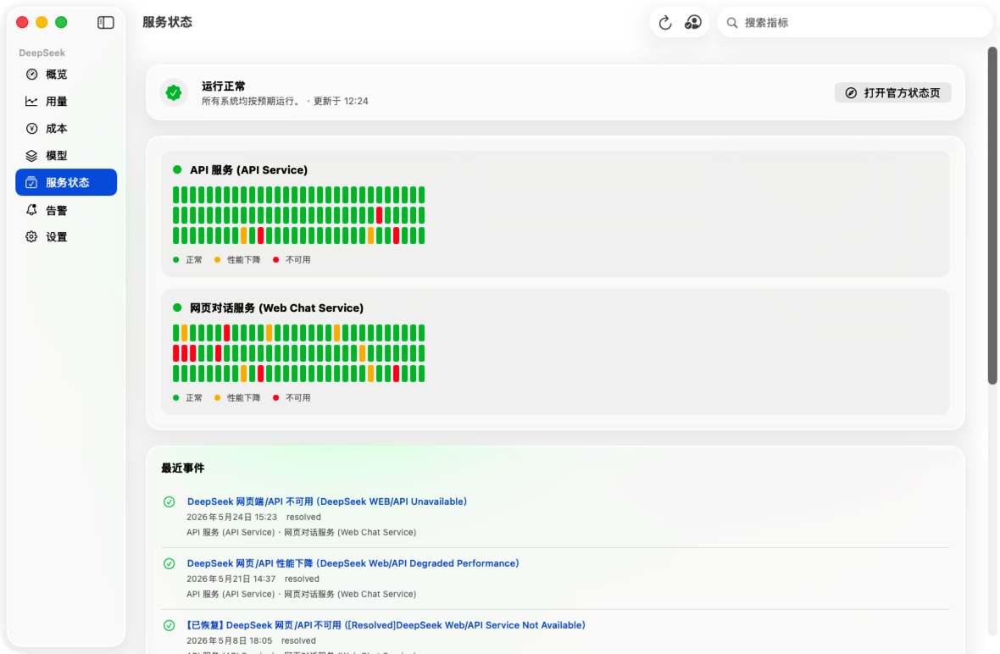
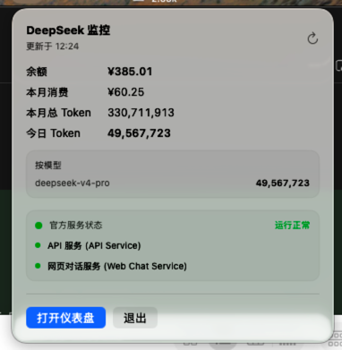

# DeepSeek Monitor

English | [中文](README.zh.md)

DeepSeek Monitor is a native macOS menu bar and desktop app for viewing DeepSeek platform balance, token usage, model breakdowns, costs, official service status, and local alert thresholds.

The app stores login credentials only on the user's Mac and does not include any bundled token, cookie, or API key.

## Screenshots








## Features

- Native SwiftUI dashboard for balance, usage, costs, model totals, and daily trends
- Menu bar summary for quick checks, including official API/Web Chat health
- Official DeepSeek service status page with Apple-style 90-day status bars, component uptime, and recent incidents
- Menu bar icon reflects official service health: white when services are healthy and red when service issues are detected
- DeepSeek login capture through an embedded web view
- Local alerts for low balance, cost thresholds, and monthly token thresholds
- Simplified Chinese and English UI text
- Unit tests for API decoding, formatting, credential storage, and alert behavior

## Requirements

- macOS 15 or later
- Xcode 26 or Swift toolchain with Swift 6.2 support

## Build

```sh
swift build
```

## Test

```sh
swift test
```

## Run And Package

The helper script builds a macOS `.app` bundle into `dist/`.

```sh
./script/build_and_run.sh run
```

Create a release build without launching:

```sh
./script/build_and_run.sh package
```

The packaged app will be at:

```text
dist/DeepSeekMonitor.app
```

## Release Archive

After packaging, create a zip suitable for GitHub Releases:

```sh
ditto -c -k --keepParent dist/DeepSeekMonitor.app dist/DeepSeekMonitor-macOS.zip
```

## Privacy And Credentials

DeepSeek Monitor saves the captured DeepSeek session token and cookie header in the user's Application Support folder:

```text
~/Library/Application Support/DeepSeekMonitor/credentials.json
```

Those credentials are not part of the source tree. Browser capture files such as `.har`, local logs, `.env` files, build outputs, and packaged apps are ignored by Git.

Before publishing a fork or release, run:

```sh
git status --ignored
rg -n --hidden -S "token|cookie|authorization|bearer|api[_-]?key|secret|password|ghp_|github_pat_" .
```

Review any matches manually. Most matches in this project are source-code references to token handling, not real secrets.

## Notes

DeepSeek platform web interfaces can change. If login capture or API calls stop working, open an issue with the app version, macOS version, and the visible error message. Do not attach HAR files or screenshots containing cookies, tokens, or account details.
